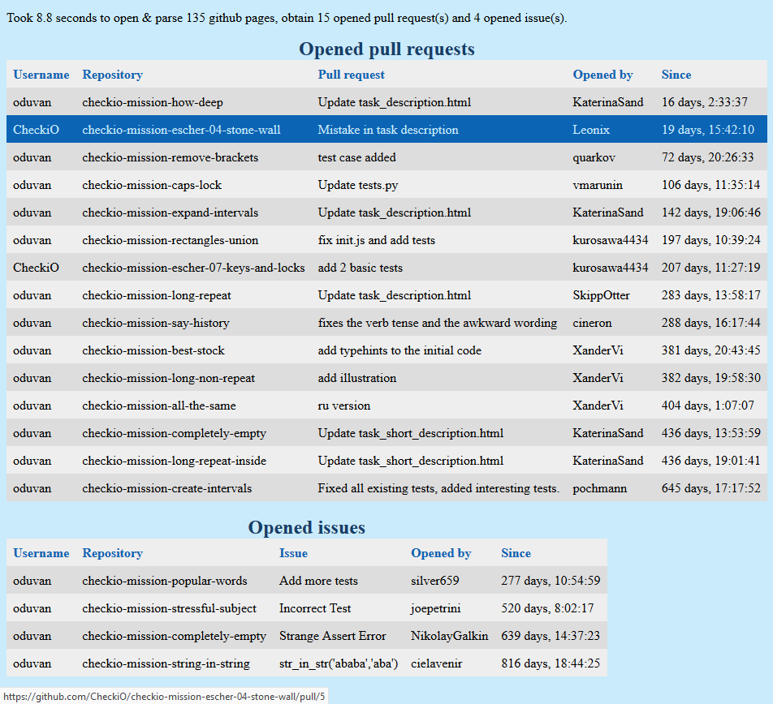

# GitHub Pulls
This personal command line tool allow to efficiently go through a lot of github repositories (from given users or given repos in a json file) to find pull requests and issues, and render results in a single webpage with links to them.

You can restrict the search to the lastest days, and sort the results according to opening dates, (owner, repo), or author.

### Requirements
- `python 3.7+` because of `asyncio.run` has been added to version 3.7.
- `aiohttp` to load webpages in an asynchronous way for efficiency.
- `beautifulsoup4` to parse html source code.

This has been tested with:
- `python==3.7.3`
- `setuptools==41.0.1`
- `aiohttp==3.5.4`
- `beautifulsoup4==4.7.1`

### Without installation
- Download `github_pulls.py`
- Then use `github_pulls.py ...` in the terminal (and in the folder where the file is).

### Installation
- Download at least `github_pulls.py`, `setup.py` and `setup.cfg` on your computer.
- Open a terminal in the folder where the files are.
- Then just write `py -m pîp install .` (or `py -m pîp install -e .` if you want to edit the script yourself, just like me).
- Finally use `github-pulls ...` in a terminal and in any folder.

### Current help message
```
usage: github-pulls [-h] [-u USER [USER ...]] [-j JSON] [-d DAYS]
                    [-s {opening,repo,author}] [--auth]

Parse github repositories for opened pull requests & issues.

optional arguments:
  -h, --help            show this help message and exit
  -u USER [USER ...], --user USER [USER ...]
                        Look users' repositories.
  -j JSON, --json JSON  JSON file with repositories (default: first json file
                        found in current folder).
  -d DAYS, --days DAYS  only ones opened in the last ... days (default: all).
  -s {opening,repo,author}, --sort {opening,repo,author}
                        sorting output (default: by opening)
  --auth                Authenticate to the github API with prompts.

Give github usernames or a json file {user: [repository, ...]}. Authenticate
if you had an error message for (repeated?) big requests.
```

### Upcoming improvements
- Fix a few things I suppose.
- Eventually add it to PyPi, but it's not my current goal.

### Examples
- **Basic use:** if you want to look issues and pull requests opened in the last 7 days in some user's repositories, just write `github-pulls -u username -d 7`.
- The python/javascript code platform [CheckiO](https://checkio.org) allows users to create their own code mission with a github repository. Then, it's hard to follow all pull requests and issues since they are in more than 300 differents repositories. This command line tool is useful to keep track of potential changes in these repositories. It only needs a json file of the repos to watch, [this one](example/CheckiO.json) for example. **Customizable use with json file:** `github-pulls -j example/CheckiO.json -d 31` will look issues and pulls opened in the last month in the repositories given in `example/CheckiO.json` ; or you can do `github-pulls -d 31` if you are in `example` folder and `CheckiO.json` is the only json in it.


