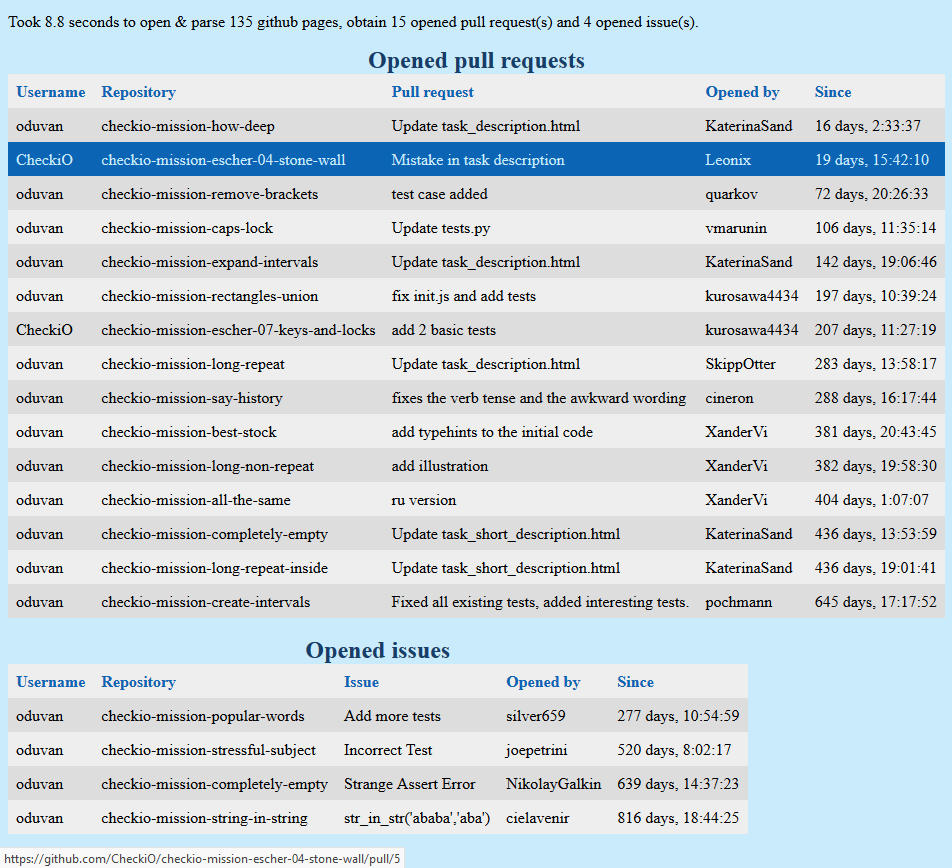

# GitHub Pulls
This personal command line utility allow to efficiently go through a lot of github repositories (from given users or given repos in a json file) to find pull requests and issues, and render results in a single webpage with links to them.

You can restrict the search to the lastest days, and sort the results according to opening dates, (owner, repo), or author.

### Current help message
```
usage: github_pulls.py [-h] [-u USER [USER ...]] [-j JSON] [-d DAYS]
                       [-s {opening,repo,author}]

Parse github repositories for opened pull requests & issues.

optional arguments:
  -h, --help            show this help message and exit
  -u USER [USER ...], --user USER [USER ...]
                        Look users' repositories.
  -j JSON, --json JSON  JSON file with repositories (default: first json file
                        found in current folder).
  -d DAYS, --days DAYS  only ones opened in the last ... days (default: all).
  -s {opening,repo,author}, --sort {opening,repo,author}
                        sorting output (default: by opening)

Give github usernames or a json file {user: [repository, ...]}.
```

### Requirements
- `python 3.6+` because I like f-strings.
- `aiohttp` to load webpages in an asynchronous way for efficiency.
- `bs4` to parse html source code.

### Upcoming improvements
- Fix the issue "Only get the last 25 open issues/pulls of each repository."
- Make the script installable with `py -m pîp install [-e] .` to be able to do `github-pulls [-h] [-u USER [USER ...]] [-j JSON] [-d DAYS] [-s {opening,repo,author}]` in any folder.
- Eventually add it to PyPi, but it's not my current goal.

#### Rendering example

